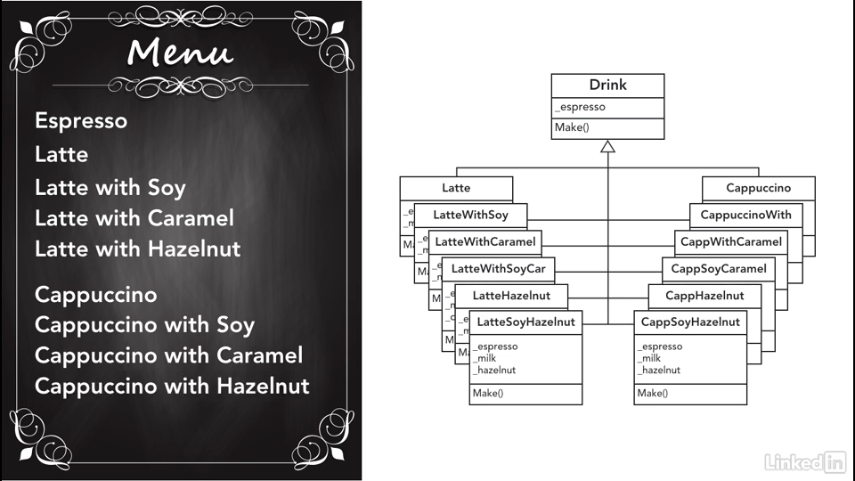

# Chapter 2 - Creational Patterns

These pattern are guides to generation _classes_ and defining their _inheritance_

#### Composition over Inheritance.

**Class Explosion :** A term used to express a situation where we inadvertently create a 
lots of classes with similar properties and minute changes. This is a design smell indicating 
a restructuring of code is required. 

Class explosion can be reduced by planning ahead about `IS-A` and `HAS-A` relationship.

#### Concrete vs Abstract

Use `virtual` keyword in base class which will always needs to be overridden in derived class.
This enforces cleaner design.
