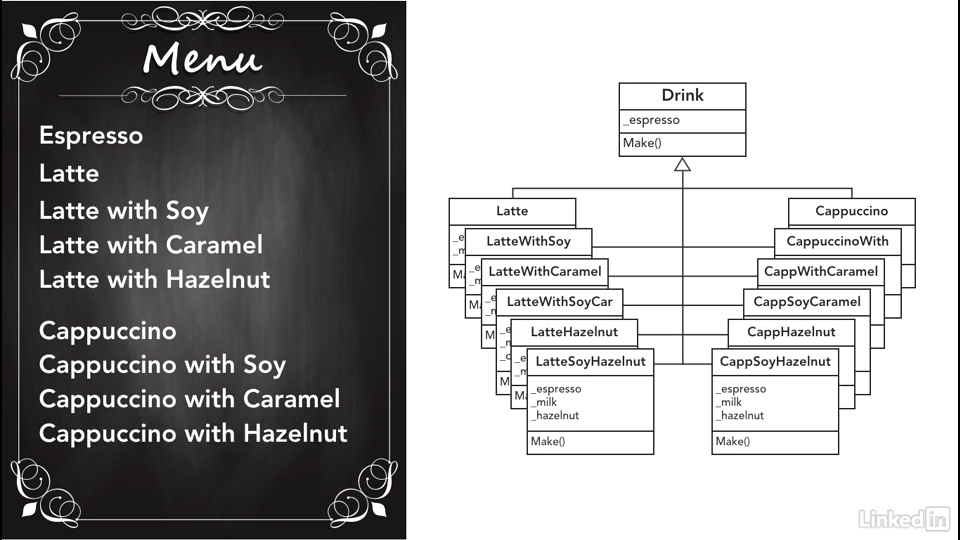

# Chapter 3 - Factory Method

This is the most used pattern. 
- Provides an interface to create an object but actual object creation is deferred 
to its subclasses.
- Base class simply provides a blueprint on what an object should look like.  
- The implementing class will create object based on the blueprint but adjusted to what its need.

- Create objects based on runtime parameter.
- You don't need to know which objects you need to create.
- The Factories **decouples** the creation of products from rest of the codebase.
